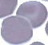

# Haar Cascade 

The image set is too large to upload into GIT, sample images can be seen below - for more images please contact me. 

## Infected Cropped Cell Samples

## Uninfected Cropped Cell Samples

##### END
