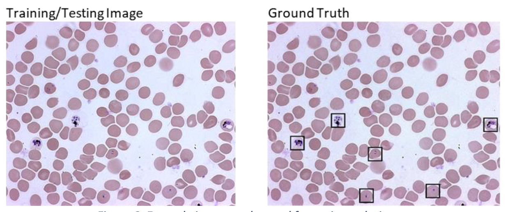

# Automatically-Detecting-Malaria
Repo to automatically detect malaria in blood sample images, using Python.

The below is a summary from my final dissertation which is loaded into the GIT repository.

## Purpose & Abstract

Malaria is spread by a parasite carried in the female mosquito, which is passed to a human when the mosquito bites them. Areas facing poverty are the most affected by Malaria, this is because there is a lack of proper healthcare. It is too expensive to pay laboratory assistants to diagnose blood samples for Malaria. To save costs, these countries simply provide anti-malarial medication to anyone showing any signs or symptoms of Malaria under clinical diagnosis. This, unfortunately, creates a drug resistance making the anti-malarial drugs ineffective. The focus of this project is to produce software that can automatically diagnose Malaria in images of Giemsa stained erythrocytes under a microscope.

The solution was to produce three different versions, this allowed using different techniques to find the most appropriate solution. The first is programmed to take the image and remove sections of it using histogram analysis, thresholding and morphology in stages, until it is left with only the dark blue sections in the image that are assumed to contain the parasite. The second program uses a machine learning approach that has never been used for this type of implementation before, this is Haar Cascading. Similar to the face recognition applications it is used for in smartphones, the cascade was trained to detect the infected cells within the images. The third program is a CNN, this is another machine learning approach which was trained to determine if cells are infected or uninfected through the use of feature and class classification.

Evaluation shows that the CNN returns the highest accuracy and f-measure score, closely behind is the Haar Cascade. The image processing through segmentation program returns the lowest accuracy, making it not useful for real life implementation. The Haar Cascade, however, proves to be the best method, as although it has a lower accuracy and f-measure score than the CNN it is a much more cost- effective method to implement in areas facing poverty.

## Understanding the Images

The data used to produce the three proposed solutions has been split into two. There is a total of 100 images that are available for the entire project. The image set was halved so that 50 images are used for the training and development of the three solutions and the other 50 will be used for the testing of the solutions. There are a further 100 images that are identical to the initial 100 images which contain the ground truth labels. An example of the two images can be seen below.

The images used have been taken from a microscopic view of a light microscope where the blood samples were first prepared by staining the blood smear with the Giemsa stain, this stain can be seen working in figure 8 where the infected cells in the ground truth image are a darker colour in comparison to the erythrocytes and background.

There is a large number of defects in the blood such as platelets, artefacts and white blood cells that also get stained with the Giemsa stain when the blood smear is prepared. The background artefacts can be seen in below. The solution for this, as it was in the articles found was to remove the background from the images, however, this needed to be done as carefully as possible to preserve the structure of the erythrocytes within the images.

## Solutions

There are three solutions to this problem that have been compared. Roughly the steps in each are:

1. Image Processing Through Segmentation
    1. Thresholding
    1. Region Labelling
    1. Morphology
    1. Region Labelling
    1. Calculate Image Moments for Cells
    1. Estimate Image Cell Count
    1. Colour Rebalance Image
    1. Identify and Label Infected Cells
2.Haar Cascade 
    1. Create Positive & Negative Image Text File
    1. Create .vec File From Positive Images
    1. Train Cascade
    
3. Convolutional Neural Network
    1. Resize Images and Convert to Grayscale
    1. Label Images
    1. Define Model Architecture
    1. Train/Save HDF5 Model

## Results

